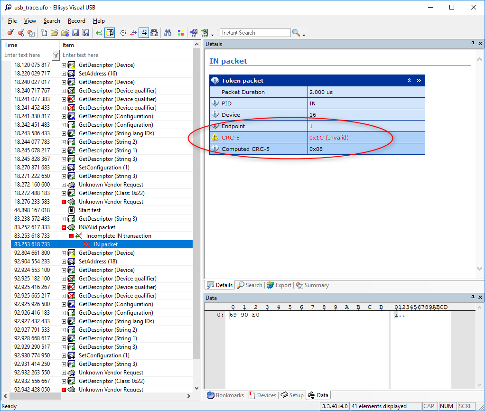

# Bug in the Raspberry Pi Zero stack
A simple program to exhibit a bug in the USB stack of the Raspberry Pi Zero.

### Sort descriptions of the bug

Randomly the Raspberry Pi Zero send corrupted CRC on ``IN`` request on interrupt endpoint.



### Context

We produce USB 2.0 device that work at Full Speed (not High Speed) and use two interrupt endpoints. See [http://www.yoctopuce.com]. Our devices are declared as HID device that use a Vendor specific protocol. Our open source library use the libUSB 1.0 to communicate with our devices.

We have tested ans used all Raspberry Pi device since the beginning. But, we discover that official Raspbian Image after march 2015 installed on a Rasbperry Pi Zero will no more work with our devices.

After some tests we found that USB packet sent by the Raspberry Pi Zero have sometime Invalid CRC. According to the USB specification (section: 8.7.1) when a device receive an invalid packet, it should ignore it and the USB host (the Raspberry Pi Zero) should resend it later.

But, on instead the libUSB return an error and is no more able to use the devices. Sometime it event completely free the Raspberry Pi Zero.

We have not been able to find if the issue is in the libUSB or the Linux kernel. But have done lots of regression testing and here is the results:

* Official Raspbian image until March 2015 does not have this issue.
* Only the Raspberry Pi Zero and Pi Zero W are affected.

We have


### Steps to compile this program

First clone this repository on your Raspberry PI Zero.
```
git clone https://github.com/yoctopuce-examples/raspberry_pi_zero_bug.git
```

then install libUSB 1.0 headers.
```
sudo apt-get install libusb-1.0-0-dev
```

Compile the file program with the following command.
```
gcc bug_pizero.c -o bug_pizero -lusb-1.0
```


### Run the test


Run the example as root
```
sudo ./bug_pizero
```


### Misc links:
USB specifications: http://www.usb.org/developers/docs/usb20_docs/
USB analyser used : http://www.ellisys.com/products/usbex200/index.php
Official Raspbian images: https://downloads.raspberrypi.org/raspbian/images/
Original project that was working with old Raspiban images:http://www.yoctopuce.com/EN/article/creating-an-multimeter-with-a-raspberry-pi-zero
